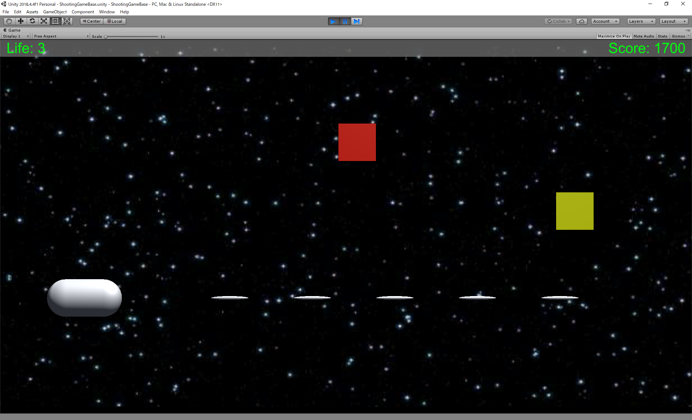
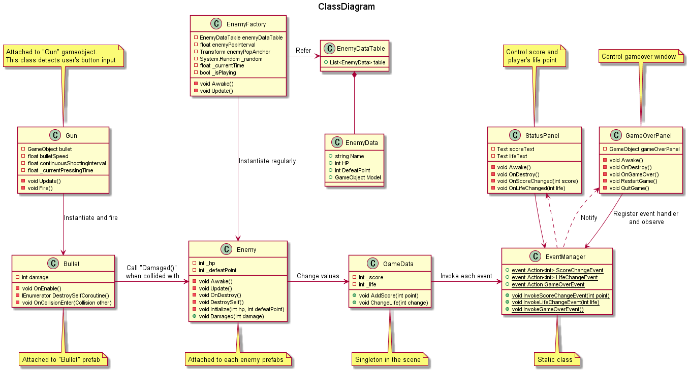

# ShootingGameBase

This README was first written by Endo on 2019/12/24.

## Abstract

This project is sample. You can play easy shooting game in **ShootingGameBase** scene (ShootingGameBase/Assets/ShootingGameBase/Scenes/ShootingGameBase.scene).

You can control Player with ↑↓→← or WASD, and shoot bullet with Space key.

Enemies have 5 levels, and each has different HP.

## Collaborators

- Current
  - Isamu Endo
  
# Software Requirement

Softwares needed to edit this project.

- **Unity (2018.4.4f1 or later)**
- IDE (Like Visual Studio / JetBrains Rider / ...)

Unity plugin / Unity Asset

- Nothing

# Structure of project

## Scenes

| Scene Name | Build Target | Description |
----|----|---- 
| *ShootingGameBase* | Windows | Main scene. You can play easy shooting game. |

## Class

### Diagram

Rough class diagram. Not all classes are drawn.

### Other classes

| Class Name | Description (What does the class do?) |
----|---- 
| *PlayerController* | Enable user to move player gameobject. |
| *BackgroundScroller* | Scroll background image permanently. |
| *ComponentExtension* | Extension of ***Component*** class. |
| [*SingletonMonoBehaviour< T >*](https://qiita.com/okuhiiro/items/3d69c602b8538c04a479) | This class makes ***class T*** singleton in the scene. |
